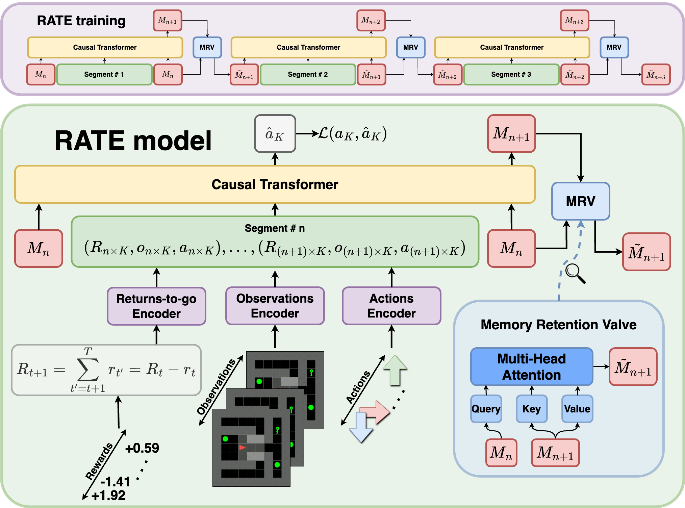
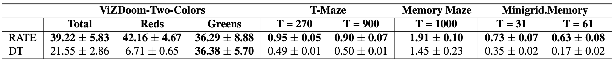
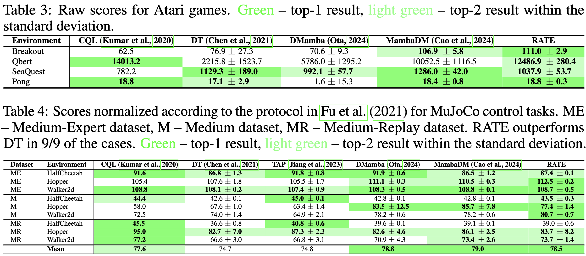

# Recurrent Action Transformer with Memory (RATE) 

## Overview



### Abstract

Recently, the use of transformers in offline reinforcement learning has become a rapidly developing area. This is due to their ability to treat the agent's trajectory in the environment as a sequence, thereby reducing the policy learning problem to sequence modeling. In environments where the agent's decisions depend on past events (POMDPs), it is essential to capture both the event itself and the decision point in the context of the model. However, the quadratic complexity of the attention mechanism limits the potential for context expansion. One solution to this problem is to extend transformers with memory mechanisms. This paper proposes a Recurrent Action Transformer with Memory (RATE), a novel model architecture that incorporates a recurrent memory mechanism designed to regulate information retention. To evaluate our model, we conducted extensive experiments on memory-intensive environments (ViZDoom-Two-Colors, T-Maze, Memory Maze, Minigrid-Memory), classic Atari games, and MuJoCo control environments. The results show that using memory can significantly improve performance in memory-intensive environments, while maintaining or improving results in classic environments. We believe that our results will stimulate research on memory mechanisms for transformers applicable to offline reinforcement learning.

## Results

To verify the performance of the model, the following memory-intensive environments (ViZDoom-Two-Colors, Minigrid.Memory, Passive-T-Maze-Flag, Memory Maze) are used in this work:


<!-- Results comparing RATE to DT on these memory-intensive benchmarks:

 -->

Results comparing RATE to DT on classic Atari and MuJoCo benchmarks:



<!-- 

 -->

## Instructions

For each environment we provide code in the following directories: `ViZDoom`, `TMaze_new`, `MinigridMemory`, `MemoryMaze`, `Atari`, and `MuJoCo`. All scripts should be run from the main directory. 

Before you start experimenting, create a `wandb_config.yaml` file for secrets in the main directory:

```python
# wandb_config.yaml
wandb_api: wandb_api_key
```

Example of usage:

**RATE**:
```bash
python3 VizDoom/VizDoom_src/train_vizdoom.py --model_mode 'RATE' --arch_mode 'TrXL' --ckpt_folder 'RATE' --text 'RATE' --nmt 5 --mem_len 300 --n_head_ca 2 --mrv_act 'relu' --skip_dec_attn
python3 TMaze_new/TMaze_new_src/train_tmaze.py --model_mode 'RATE' --arch_mode 'TrXL' --curr 'false' --ckpt_folder 'RATE_max_3' --max_n_final 3 --text 'RATE_max_3' --nmt 5 --mem_len 0 --n_head_ca 4 --mrv_act 'relu' --skip_dec_attn
python3 MinigridMemory/MinigridMemory_src/train_minigridmemory.py --model_mode 'RATE' --arch_mode 'TrXL' --ckpt_folder 'RATE' --text 'RATE' --nmt 15 --mem_len 180 --n_head_ca 1 --mrv_act 'relu' --skip_dec_attn
python3 -W ignore MemoryMaze/MemoryMaze_src/train_mem_maze.py --model_mode 'RATE' --arch_mode 'TrXL' --ckpt_folder 'RATE' --text 'RATE' --nmt 5 --mem_len 300 --n_head_ca 2 --mrv_act 'relu' --skip_dec_attn
```

**DT**:
```bash
python3 VizDoom/VizDoom_src/train_vizdoom.py --model_mode 'DT' --arch_mode 'TrXL' --ckpt_folder 'DT' --text 'DT' --nmt 0 --mem_len 0 --n_head_ca 0 --mrv_act 'no_act'
python3 TMaze_new/TMaze_new_src/train_tmaze.py --model_mode 'DT' --arch_mode 'TrXL' --curr 'false' --ckpt_folder 'DT' --max_n_final 3 --text 'DT_max_3' --nmt 0 --mem_len 0 --n_head_ca 0 --mrv_act 'no_act'
python3 MinigridMemory/MinigridMemory_src/train_minigridmemory.py --model_mode 'DT' --arch_mode 'TrXL' --ckpt_folder 'DT' --text 'DT' --nmt 0 --mem_len 0 --n_head_ca 0 --mrv_act 'no_act'
python3 -W ignore MemoryMaze/MemoryMaze_src/train_mem_maze.py --model_mode 'DT' --arch_mode 'TrXL' --ckpt_folder 'DT' --text 'DT' --nmt 0 --mem_len 0 --n_head_ca 0 --mrv_act 'no_act'
```

**RMT**:
```bash
python3 VizDoom/VizDoom_src/train_vizdoom.py --model_mode 'RATE' --arch_mode 'TrXL' --ckpt_folder 'RMT' --text 'RMT' --nmt 5 --mem_len 0 --n_head_ca 0 --mrv_act 'no_act'
python3 TMaze_new/TMaze_new_src/train_tmaze.py --model_mode 'RATE' --arch_mode 'TrXL' --curr 'false' --ckpt_folder 'RMT_max_3' --max_n_final 3 --text 'RMT_max_3' --nmt 5 --mem_len 0 --n_head_ca 0 --mrv_act 'no_act'
python3 MinigridMemory/MinigridMemory_src/train_minigridmemory.py --model_mode 'RATE' --arch_mode 'TrXL' --ckpt_folder 'RMT' --text 'RMT' --nmt 15 --mem_len 0 --n_head_ca 0 --mrv_act 'no_act'
python3 -W ignore MemoryMaze/MemoryMaze_src/train_mem_maze.py --model_mode 'RATE' --arch_mode 'TrXL' --ckpt_folder 'RMT' --text 'RMT' --nmt 5 --mem_len 0 --n_head_ca 0 --mrv_act 'no_act'
```

**TrXL**:
```bash
python3 VizDoom/VizDoom_src/train_vizdoom.py --model_mode 'RATE' --arch_mode 'TrXL' --ckpt_folder 'TrXL' --text 'TrXL' --nmt 0 --mem_len 270 --n_head_ca 0 --mrv_act 'no_act'
python3 TMaze_new/TMaze_new_src/train_tmaze.py --model_mode 'RATE' --arch_mode 'TrXL' --curr 'false' --ckpt_folder 'TrXL_max_3' --max_n_final 3 --text 'TrXL_max_3' --nmt 0 --mem_len 270 --n_head_ca 0 --mrv_act 'no_act'
python3 MinigridMemory/MinigridMemory_src/train_minigridmemory.py --model_mode 'RATE' --arch_mode 'TrXL' --ckpt_folder 'RMT' --text 'TrXL' --nmt 0 --mem_len 90 --n_head_ca 0 --mrv_act 'no_act'
python3 -W ignore MemoryMaze/MemoryMaze_src/train_mem_maze.py --model_mode 'RATE' --arch_mode 'TrXL' --ckpt_folder 'TrXL' --text 'TrXL' --nmt 0 --mem_len 360 --n_head_ca 0 --mrv_act 'no_act'
```

### ViZDoom-Two-Colors

#### Dataset

First, create the `VizDoom/VizDoom_data/iterative_data/` directory.
Then a dataset can be generated by executing the `VizDoom/VizDoom/VizDoom_notebooks/generate_iter_data.ipynb` file.

#### Run experiment

```python
python3 VizDoom/VizDoom_src/train_vizdoom.py --model_mode 'RATE' --arch_mode 'TrXL' --ckpt_folder 'RATE_ckpt' --text 'my_comment' --nmt 5 --mem_len 300 --n_head_ca 2 --mrv_act 'relu' --skip_dec_ffn
```

Where:

1. `model_mode` - select model:
    - 'RATE' - our model
    - 'DT' - Decision Transformer model
    - 'DTXL' - Decision Transformer woth caching hidden states
    - 'RATEM' - RATE without caching hidden states
    - 'RATE_wo_nmt' - RATE without memory embeddings
2. `arch_mode` - select backbone model:
    - 'TrXL'
    - 'TrXL-I'
    - 'GTrXL'
3. `ckpt_folder` - folder to save checkpoint
4. `text` - text comment to the experiment
5. `nmt` - number of memory tokens
6. `mem_len` - number of previous cached hidden states. 
    - Recommended value: `mem_len` = (3 x `K` + 2 x `nmt`) x `N`, where `K` - context length, `N` - number of segments
7. `mrv_act` - Memory Retention Valve actiovation function
7. `skip_dec_ffn` - Skip FFN in transformer decoder


### T-Maze

#### Dataset

The dataset is generated automatically and stored in the `TMaze_new/TMaze_new_data` directory.

#### Example usage

```python
python3 TMaze_new/TMaze_new_src/train_tmaze.py --model_mode 'RATE' --arch_mode 'TrXL' --curr 'true' --ckpt_folder 'RATE_max_3' --max_n_final 3 --text 'my_comment' --nmt 5 --mem_len 0 --n_head_ca 4 --mrv_act 'relu' --skip_dec_attn
```

Where:

1. `max_n_final` - maximum number of segments `N` of length `K` processed during traininng (`max_n_final` = 3 -> training on trajectories of length up to `max_n_fimal` x `K`)
2. `curr` - use curriculum learning or not

### Minigrid.Memory

#### Dataset

Then a dataset can be downloaded by executing the `MinigridMemory/get_data/collect_traj.py` file.

### Memory Maze

#### Dataset

The dataset can be collected using https://github.com/NM512/dreamerv3-torch.

### Atari

#### Installation

Dependencies can be installed with the following command:

```
conda env create -f conda_env.yml
```

#### Downloading datasets


Create a directory for the dataset and load the dataset using [gsutil](https://cloud.google.com/storage/docs/gsutil_install#install). Replace `[DIRECTORY_NAME]` and `[GAME_NAME]` accordingly (e.g., `./dqn_replay` for `[DIRECTORY_NAME]` and `Breakout` for `[GAME_NAME]`)
```
mkdir [DIRECTORY_NAME]
gsutil -m cp -R gs://atari-replay-datasets/dqn/[GAME_NAME] [DIRECTORY_NAME]
```

In the `wandb_config.yaml` in the main directory add the following lines to specify the directory with Atari data:

```python
atari:
  data: '/path/to/atari/data/'
```

#### Example usage

```python
python3 Atari/train_rate_atari.py --game Breakout --num_mem_tokens 15 --mem_len 360 --n_head_ca 1 --mrv_act 'relu' --skip_dec_ffn --seed 123
python3 Atari/train_rate_atari.py --game Qbert --num_mem_tokens 15 --mem_len 360 --n_head_ca 1 --mrv_act 'relu' --skip_dec_ffn --seed 123
python3 Atari/train_rate_atari.py --game Seaquest --num_mem_tokens 15 --mem_len 360 --n_head_ca 1 --mrv_act 'relu' --skip_dec_ffn --seed 123
python3 Atari/train_rate_atari.py --game Pong --num_mem_tokens 15 --mem_len 360 --n_head_ca 1 --mrv_act 'leaky_relu' --skip_dec_ffn --seed 123
```

### MuJoCo

#### Installation

Experiments require MuJoCo.
Follow the instructions in the [mujoco-py repo](https://github.com/openai/mujoco-py) to install.
Then, dependencies can be installed with the following command:

```
conda env create -f conda_env.yml
```

### Downloading datasets

Datasets are stored in the `data` directory.
Install the [D4RL repo](https://github.com/rail-berkeley/d4rl), following the instructions there.
Then, run the following script in order to download the datasets and save them in our format:

```
python download_d4rl_datasets.py
```

In the `wandb_config.yaml` in the main directory add the following lines:

```python
mujoco:
  data_dir_prefix: '/path/to/mujoco/data/'
```

#### Example usage

```python
python3 MuJoCo/train_rate_mujoco_ca.py --env_id 0 --number_of_segments 3 --segment_length 20 --num_mem_tokens 5 --n_head_ca 1 --mrv_act 'relu' --skip_dec_ffn --seed 123
```

Where `env_id` - id of MuJoCo task:

1. `env_id` - MuJoCo environment id:
    - 0 → `halfcheetah-medium`
    - 1 → `halfcheetah-medium-replay`
    - 2 → `halfcheetah-expert`
    - 3 → `walker2d-medium`
    - 4 → `walker2d-medium-replay`
    - 5 → `walker2d-expert`
    - 6 → `hopper-medium`
    - 7 → `hopper-medium-replay`
    - 8 → `hopper-expert`
    - 9 → `halfcheetah-medium-expert`
    - 10 → `walker2d-medium-expert`
    - 11 → `hopper-medium-expert`

## License

MIT