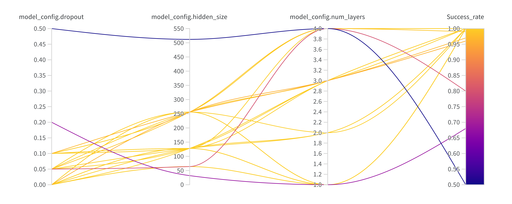
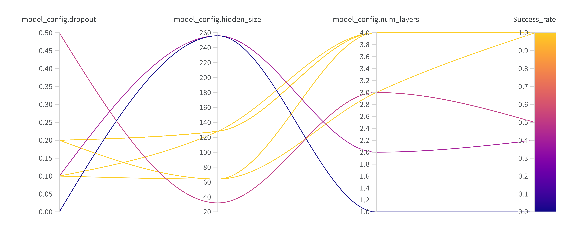
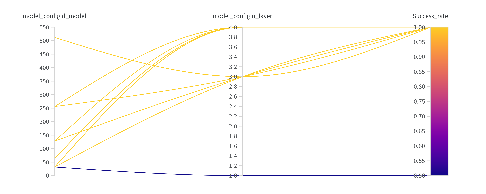
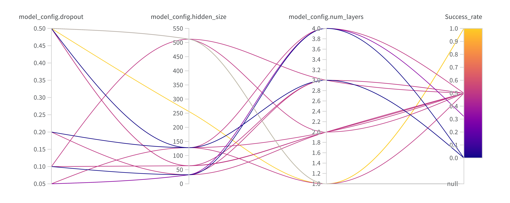
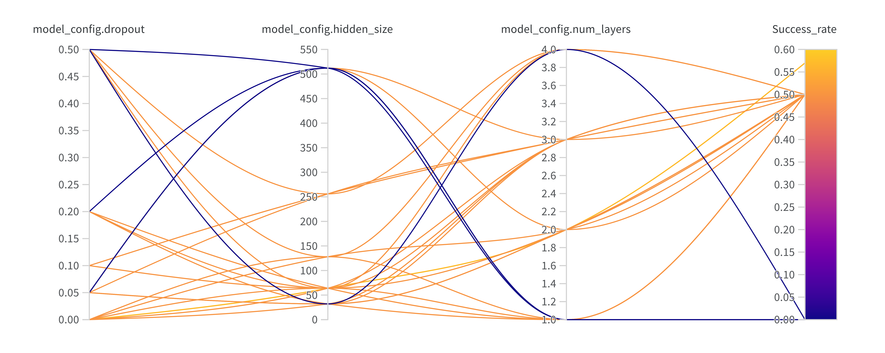
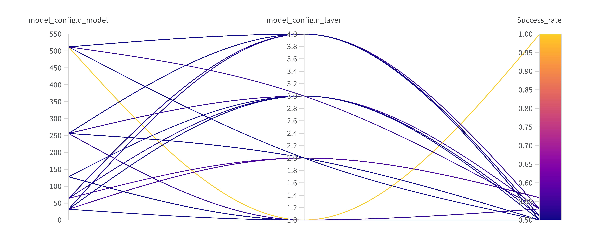
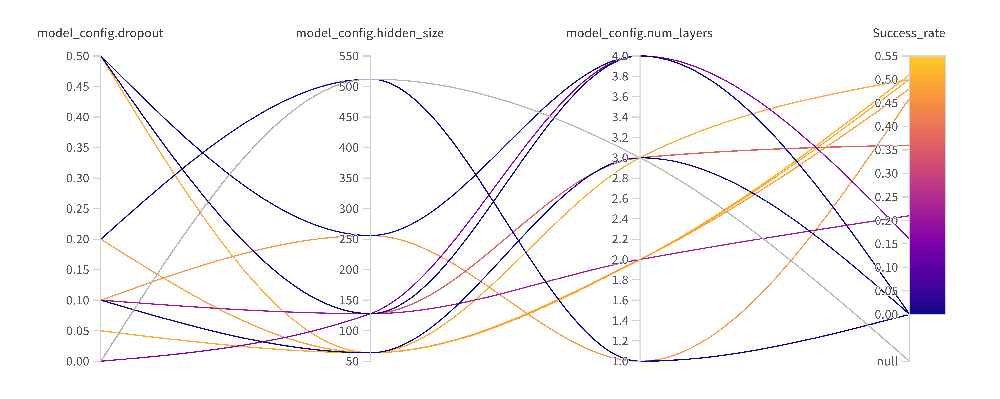
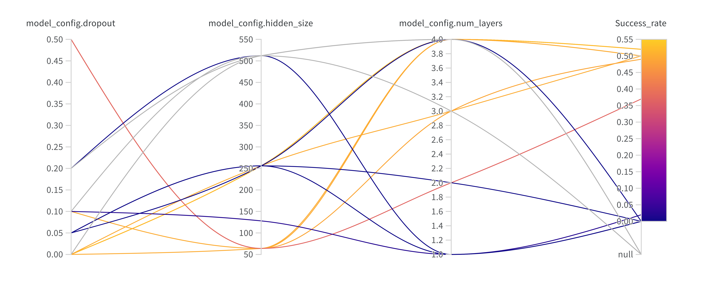
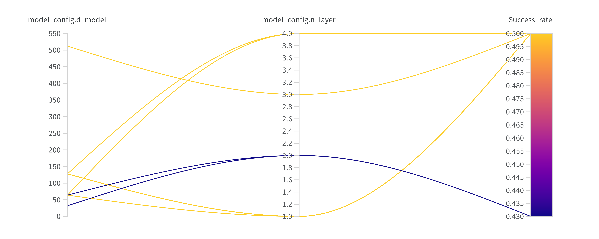

# RNN and SSM Baselines

This directory contains implementations of various RNN and SSM architectures specifically tested on T-Maze and ViZDoom-Two-Colors memory-intensive environments for comparison with our RATE model.

## Implemented Architectures

### DLSTM & DGRU
Decision LSTM (DLSTM) and Decision GRU (DGRU) implementations are based on the [decision-lstm repository](https://github.com/max7born/decision-lstm/). DGRU was derived by adapting the DLSTM architecture to use GRU cells instead of LSTM cells.

### DMamba
Decision Mamba (DMamba) implementation is based on the [decision-mamba repository](https://github.com/Toshihiro-Ota/decision-mamba/tree/main).

## Environments

### T-Maze Environment

> **Note**: All commands must be executed from the repository root directory.

In this section, we perform training and validation on trajectories of the same length, i.e., we train models on data of length K and validate them on T-Maze corridors of length T = K (testing the models' ability to learn at all).

The default configuration uses context length K = 90 as specified in `config_lstm_K_90.yaml`. At K = 90, DLSTM, DGRU, and DMamba showed SR $\leq$ 50%. At K = 30, only DGRU and DMamba were able to learn, while at K = 9, all baselines were able to learn. This indicates that the considered baselines are generally capable of solving the T-Maze task, but only on short trajectories (in contrast to transformer architectures).

Below is a table showing the results of the best configurations for each model. When training these models at each time step, we process the triplet $(R, o, a)$, where $R$ is the reward, $o$ is the observation, and $a$ is the action. Therefore, processing $K$ steps, we actually process $3\times K$ tokens.

|    	| DLSTM | DGRU | DMamba | DT  | RATE |
| ------ | ----- | ---- | ------ | --- | ---- |
| T=K=9  | 1.0   | 1.0  | 1.0	| 1.0 | 1.0  |
| T=K=30 | 0.6   | 1.0  | 1.0	| 1.0 | 1.0  |
| T=K=90 | 0.5   | 0.5  | 0.5	| 1.0 | 1.0  |

When processing only observations $o$ at each time step, recurrent models show better results than when processing triplets (previously SR = 1.0 at $T = K = 30$, now SR = 1.0 at $T = K = 90$), however, it is important to note that in this case the context $K$ is actually equal to $K$ tokens, so in terms of the number of tokens $K_{DLSTM} \times 3 = K_{LSTM}$.

|    	| LSTM | GRU | Mamba |
| ------ | ----- | ---- | ------ |
| T=K=9  | 1.0   | 1.0  | 1.0	|
| T=K=30 | 0.72   | 1.0  | 1.0	|
| T=K=90 | 0.5   | 1.0  | 1.0	|
| T=K=270 | 0.0*   | 0.32  | 0.55 |

#### Training Commands

**DLSTM & DGRU:**
```bash
# DLSTM Training
python3 recurrent_baselines/LSTM_GRU/tmaze/lstm_train_tmaze.py \
    --model_mode 'LSTM' \
    --curr 'false' \
    --ckpt_folder 'LSTM_no_curr_max_3' \
    --max_n_final 3 \
    --text 'LSTM_no_curr'

# DGRU Training
python3 recurrent_baselines/LSTM_GRU/tmaze/lstm_train_tmaze.py \
    --model_mode 'GRU' \
    --curr 'false' \
    --ckpt_folder 'GRU_no_curr_max_3' \
    --max_n_final 3 \
    --text 'GRU_no_curr'
```

**DMamba:**
```bash
python3 recurrent_baselines/Mamba/tmaze/mamba_train_tmaze.py \
    --model_mode 'MAMBA' \
    --curr 'false' \
    --ckpt_folder 'MAMBA_max_3_no_curr' \
    --max_n_final 3 \
    --text 'MAMBA_max_3_no_curr'
```

#### Hyperparameter Sweeps

Sweeps are available for different context lengths (K = 9, 30, 90):

**DLSTM & DGRU:**
```bash
# K = 9
python3 recurrent_baselines/LSTM_GRU/tmaze/sweeps_K_9/run_sweep_lstm.py
python3 recurrent_baselines/LSTM_GRU/tmaze/sweeps_K_9/run_sweep_gru.py

# K = 30
python3 recurrent_baselines/LSTM_GRU/tmaze/sweeps_K_30/run_sweep_lstm.py
python3 recurrent_baselines/LSTM_GRU/tmaze/sweeps_K_30/run_sweep_gru.py

# K = 90
python3 recurrent_baselines/LSTM_GRU/tmaze/sweeps_K_90/run_sweep_lstm.py
python3 recurrent_baselines/LSTM_GRU/tmaze/sweeps_K_90/run_sweep_gru.py
```

**DMamba:**
```bash
# K = 9
python3 recurrent_baselines/Mamba/tmaze/sweeps_K_9/run_sweep_mamba.py

# K = 30
python3 recurrent_baselines/Mamba/tmaze/sweeps_K_30/run_sweep_mamba.py

# K = 90
python3 recurrent_baselines/Mamba/tmaze/sweeps_K_90/run_sweep_mamba.py
```

### ViZDoom-Two-Colors Environment

#### Training Commands

**DLSTM & DGRU:**
```bash
# DLSTM Training
python3 recurrent_baselines/LSTM_GRU/vizdoom/lstm_train_vizdoom.py \
    --model_mode 'LSTM' \
    --ckpt_folder 'LSTM' \
    --text 'LSTM'

# DGRU Training
python3 recurrent_baselines/LSTM_GRU/vizdoom/lstm_train_vizdoom.py \
    --model_mode 'GRU' \
    --ckpt_folder 'GRU' \
    --text 'GRU'
```

**DMamba:**
```bash
python3 recurrent_baselines/Mamba/vizdoom/mamba_train_vizdoom.py \
    --model_mode 'MAMBA' \
    --ckpt_folder 'MAMBA' \
    --text 'MAMBA'
```

#### Hyperparameter Sweeps

**DLSTM & DGRU:**
```bash
python3 recurrent_baselines/LSTM_GRU/vizdoom/sweeps/run_sweep_lstm.py
python3 recurrent_baselines/LSTM_GRU/vizdoom/sweeps/run_sweep_gru.py
```

**DMamba:**
```bash
python3 recurrent_baselines/Mamba/vizdoom/sweeps/run_sweep_mamba.py
```

## Sweep Results

### GRU K = 9


### LSTM K = 9


### MAMBA K = 9


### GRU K = 30


### LSTM K = 30


### MAMBA K = 30


### GRU K = 90


### LSTM K = 90


### MAMBA K = 90
